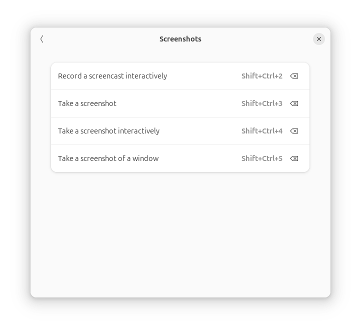
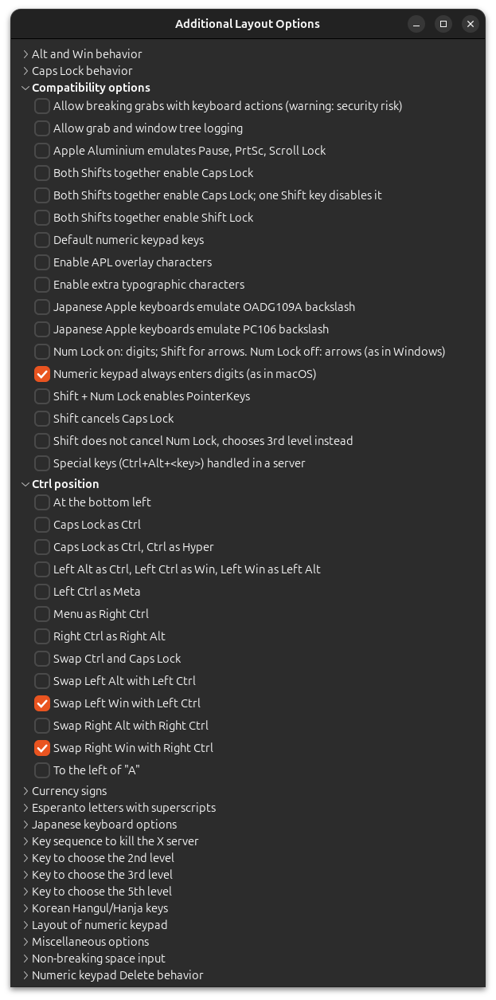
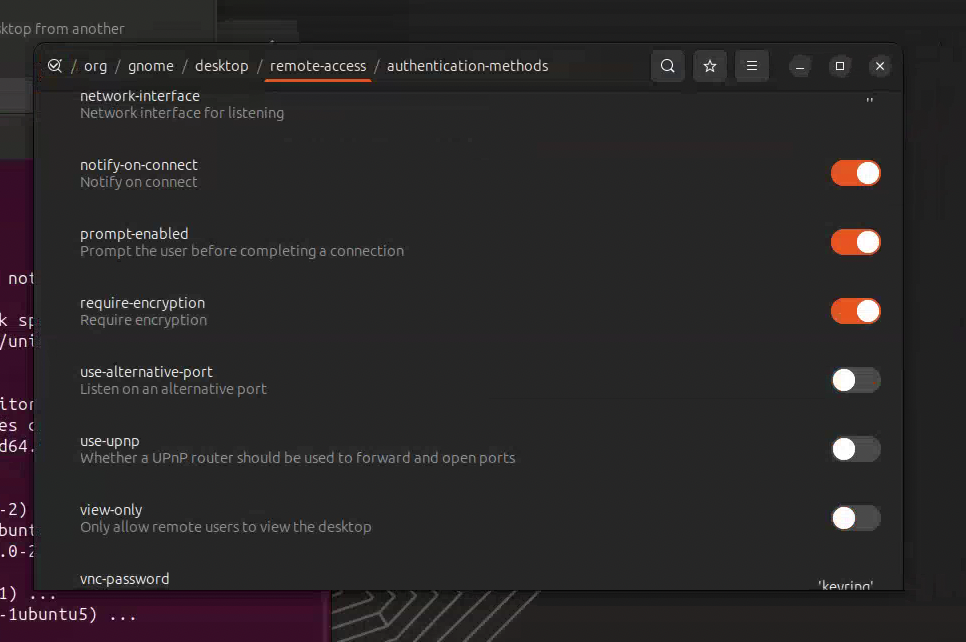

# Ubuntu Setup 2024

## Initial Settings
- settings appearance Dark
- mouse direction natural
- keyboard custom shortcuts -> screenshot - you'll need to do this after gnome tweaks



## Git Installation
```bash
sudo apt update && sudo apt install git
git config --global user.name "itaki"
git config --global user.email "mritaki@gmail.com"
```

## Keyring Error Fix
```bash
sudo apt install gnome-keyring libsecret-1-0 libsecret-1-dev
```

## Install Gnome Tweaks
```bash
sudo add-apt-repository universe
sudo apt install gnome-tweaks
gnome-tweaks
```

## Fix Keyboard
1. To reverse the win and command keys
2. To make numkeys always type numbers
   - Gnome Tweaks/Keyboard & mouse/Additional Layout Options/Compatibility Options/Numeric keypad
   - always enters digit (as in macOS)



## App Center Installations
- brave/lastpass
- code
- vlc
- transmission
- sublimetext

## Install Cursor
- Log into VSCode so cursor will get extensions
- Install git
```bash
sudo apt update && sudo apt install git
git config --global user.name "itaki"
git config --global user.email "mritaki@gmail.com"
```

- git UbuntuSetup repo
```bash
chmod +x install_cursor.sh
./install_cursor.sh
```

## Install NoMachine

## Install OpenSnitch
- download and install from downloaded directory
- YouTube Video

## Installing and setting up SAMBA
Here's the essential step-by-step guide to set up SMB shares on Ubuntu for QNAP NAS access:

1. Install required packages:
```bash
sudo apt install samba samba-common gvfs-backends gvfs-fuse
```

2. Create and edit the Samba configuration file:
```bash
sudo nano /etc/samba/smb.conf
```

3. Add these specific settings to the [global] section:
```ini
[global]
client min protocol = SMB2
client max protocol = SMB3
security = user
name resolve order = bcast host
ntlm auth = yes
client use spnego = yes
disable netbios = yes
```

4. Restart the GVFS daemon:
```bash
systemctl --user restart gvfs-daemon
```

That's it! The key was getting the right SMB protocol settings in place and disabling NetBIOS. After this, you should be able to see and connect to QNAP shares in the Ubuntu file browser.
Note: When connecting, use your QNAP username and password, and leave the domain field blank.

## Install NoMachine
- install virtual display driver
```bash
sudo apt-get install xvfb
```

then start it
```bash
Xvfb :1 -screen 0 3840x2160x24 &
export DISPLAY=:1
```

then add it to startup
```bash
echo 'Xvfb :1 -screen 0 3840x2160x24 &' | sudo tee -a /etc/rc.local
```

## Fix VLC Font Issues
```bash
sudo rm /var/cache/fontconfig/*
rm ~/.cache/fontconfig/*
fc-cache -r
```

## TigerVNC Installation
```bash
sudo apt install tigervnc-standalone-server tigervnc-common

# Set VNC password
vncpasswd
# Create config file
mkdir -p ~/.vnc
nano ~/.vnc/config
```

config
```
geometry=3840x2160
depth=24
```

Start
```bash
vncserver :1
```

auto start on boot
```bash
sudo nano /etc/systemd/system/vncserver@.service
```

add service to config
```ini
[Unit]
Description=Remote desktop service (VNC)
After=syslog.target network.target
[Service]
Type=simple
User=YOUR_USERNAME
PAMName=login
PIDFile=/home/%u/.vnc/%H:%i.pid
ExecStartPre=/bin/sh -c '/usr/bin/vncserver -kill :%i > /dev/null 2>&1 || :'
ExecStart=/usr/bin/vncserver :%i -depth 24 -geometry 3840x2160
ExecStop=/usr/bin/vncserver -kill :%i
[Install]
WantedBy=multi-user.target
```

enable and start
```bash
sudo systemctl daemon-reload
sudo systemctl enable vncserver@1
sudo systemctl start vncserver@1
```

## Install Dropbox

## Installing NUKE
```bash
tar -xvzf Nuke15.1v1-linux-x86_64.tgz
chmod +x Nuke15.1v1-linux-x86_64.run
```

After installing, you get a directory with a Nuke15.1v1 file in it that is NOT executable.
create new desktop entry
```bash
sudo nano /usr/share/applications/nuke.desktop
```

```ini
[Desktop Entry]
Version=1.0
Type=Application
Name=NukeX
Comment=The Foundry NukeX
Exec=/home/mm/Nuke15.1v1/Nuke15.1 %f
Icon=/home/mm/Nuke15.1v1/plugins.icons/NukeXApp48.png
Terminal=false
Categories=Graphics;Video;
MimeType=application/x-nuke;
```

```bash
sudo chmod +x /usr/share/applications/nuke.desktop
sudo update-mime-database /usr/share/mime
xdg-mime default nuke.desktop /home/mm/Nuke15.1v1/Nuke15.1
```

Right click on nuke file and make sure it's being opened by the right file.

## Installing RLM
Make both the rlm and rlm client executable
it will fail because of a missing directory.
create the directory
to run every time follow chatgtps instructions

1. Create a systemd service file:
```bash
sudo nano /etc/systemd/system/rlmd.service
```

1. Edit the service file:
```ini
[Unit]
Description=RLM License Server
After=network.target
[Service]
Type=forking
ExecStart=/opt/rlm/rlm -dlog /opt/rlm/rlm_lic.dlog
ExecStop=/bin/kill -s QUIT $MAINPID
User=root
Group=root
Restart=always
[Install]
WantedBy=multi-user.target
```

1. Reload systemd manager configuration:
```bash
sudo systemctl daemon-reload
```

1. Enable the service:
```bash
sudo systemctl enable rlmd.service
```

1. Start the service:
```bash
sudo systemctl start rlmd.service
```

1. Check the status of the service:
```bash
sudo systemctl status rlmd.service
```

## CUDA Setup for AIR
YouTube Video

## Remote Access Setup


## SSH Setup
Install SSH server
```bash
ssh mm@donkey-workstation.local
```

install vino - also turn on screen sharing in sharing in ubuntu settings.
```bash
sudo apt update -y
sudo apt install vino -y
vino-preferences
```

Then I'll need to turn OFF encryption
```bash
sudo apt-get install dconf-editor
dconf-editor
```

Find the config item in dconf-editor with path "desktop.gnome.remote-access". You need to uncheck the "require encryption" to support OSX, otherwise the authentication is unsupported on OSX.
Just search for remote access.

```bash
hostname -I
```

You're running in a GNOME environment but the OS keyring is not available for encryption. Ensure you have gnome-keyring or another libsecret compatible implementation installed and running. 